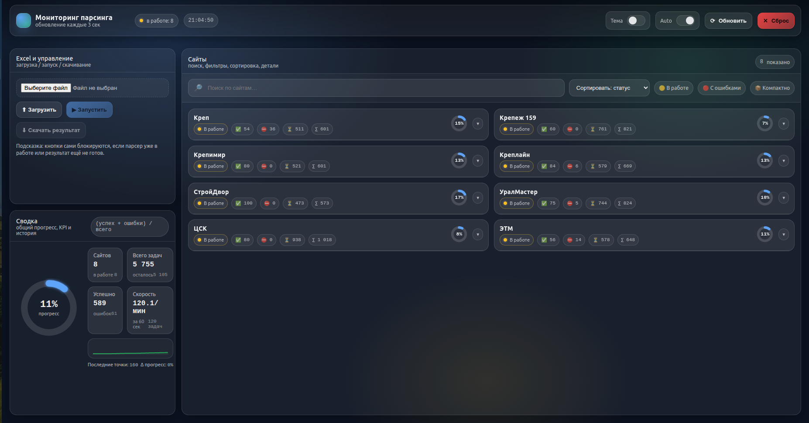

# Price Parser

FastAPI-сервис для массового парсинга цен из Excel-таблицы по ссылкам на товары.

Проект берёт исходный Excel (`storage/source.xlsx`), асинхронно обходит ссылки по нескольким поставщикам, собирает цены, сохраняет детальный `result.json` и формирует итоговый `result_filled.xlsx`.

`Проект представлен в качестве демонстрационного примера и отражает навыки разработки и архитектурные решения.`

## Что умеет

- Загружать Excel через API/UI.
- Параллельно обрабатывать сайты (по одному воркеру на сайт).
- Обновлять прогресс по каждому сайту в БД (`parse_jobs`).
- Применять антиблок-логику для 403 (cooldown + аварийная остановка сайта).
- Поддерживать разные стратегии извлечения цены:
  - HTML-парсинг (BeautifulSoup + site-specific extractor).
  - API-парсинг для `СтройДвор` через `api-gateway.sdvor.com`.
- Отдавать статус выполнения и готовый Excel для скачивания.
- Вести текстовые и JSON-логи через кастомный логгер.

## Стек

- Python 3.12
- FastAPI + Uvicorn
- SQLAlchemy Async (SQLite по умолчанию, PostgreSQL опционально)
- httpx
- openpyxl
- BeautifulSoup4 + lxml
- Jinja2 (страница мониторинга)

## Интерфейс

Пример страницы мониторинга во время парсинга:



## Пример входной таблицы

Данная таблица - вырезка из реальной, рабочей таблицы клиента:

| Код | Наименование | Группа | Роль | Ссылка ЦСК | Ссылка Крепеж 159 | Ссылка СтройДвор | Ссылка УралМастер | Ссылка ЭТМ | Ссылка Креплайн | Ссылка Креп | Ссылка Крепимир | Цена ЦСК | Цена К159 | Цена СД | Цена УМ | Цена ЭТМ | Цена Креплайн | Цена Креп | Цена Крепимир |
|---|---|---|---|---|---|---|---|---|---|---|---|---:|---:|---:|---:|---:|---:|---:|---:|
| Л01-5050 | Скотч малярный белый 50х40 | Малярные ленты | Основная | [link](https://xn--j1ano.xn--p1ai/product/skotch_malyarnyy_belyy_50h50) | [link](https://xn--159-qddfw0bg9m.xn--p1ai/product/skotch-malyarnyj-50mm40m-klebebander/) | [link](https://www.sdvor.com/perm/product/lenta-maliarnaia-48mmkh40m-stroitelnyi-dvor-571405) | [link](https://www.ural-master.ru/catalog/lenty_kleykie_signalnye_skotch_plenki/lenta_malyarnaya_50mm_kh50m_/) | [link](https://www.etm.ru/cat/nn/4736509?city=59) | — | [link](https://vkrep.ru/ckotch-kleyevyye-lenty/malyarnyy-skotch/skotch-malyarnyy-50-40-40-m) | [link](https://krepi-mir.ru/catalog/khimiya/kleykie_lenty/malyarnaya_kleykaya_lenta/36622/) | 139 | 167 | 296 | 276 | 403.31 | — | 163.2 | 204 |
| Л40-5050 | Скотч алюминиевый 50х50 50 мк Klebebander | — | — | [link](https://xn--j1ano.xn--p1ai/product/skotch_alyuminievyy_50h50_50mk_klebebander) | — | [link](https://www.sdvor.com/perm/product/soedinitelnaja-lenta-izospan-fl-50mmh50-mp-21056) | [link](https://www.ural-master.ru/catalog/lenty_kleykie_signalnye_skotch_plenki/lenta_kleykaya_alyuminievaya_50mm_50m_osobo_prochnaya_/) | [link](https://www.etm.ru/cat/nn/8445912) | [link](https://krepline59.ru/katalog/raskhodnye-materialy/lenty-stroitelnye-lenty-kleykie-plenki-meshki/kleykie-lenty-alyuminievye-skotch/product-9188472) | [link](https://vkrep.ru/ckotch-kleyevyye-lenty/alyuminiyevyy-skotch-i-metallizirovannaya-lenta/skotch-alyuminiyevyy-50-mm-50-m) | [link](https://krepi-mir.ru/catalog/khimiya/kleykie_lenty/alyuminevye_i_metallizirovannye_kleykie_lenty/36261/) | 513 | — | 319 | 600 | 379.94 | 615 | 224 | 651 |
| Л10-5050-2 | Скотч водозащитный ТПЛ 50х50 серый | — | — | [link](https://xn--j1ano.xn--p1ai/product/skotch_vodozaschitnyy_tpl_50h50_seryy) | — | — | [link](https://www.ural-master.ru/catalog/lenty_kleykie_signalnye_skotch_plenki/lenta_kleykaya_universalnaya_tpl_seraya_48mm_kh50m_armirovannaya_/) | [link](https://www.etm.ru/cat/nn/467515) | [link](https://krepline59.ru/katalog/raskhodnye-materialy/lenty-stroitelnye-lenty-kleykie-plenki-meshki/kleykie-lenty-alyuminievye-skotch/product-9187271) | [link](https://vkrep.ru/ckotch-kleyevyye-lenty/armirovannaya-lenta/armirovannaya-kleykaya-lenta-50-50-serebr) | [link](https://krepi-mir.ru/catalog/khimiya/kleykie_lenty/armirovannye_kleykie_lenty/36555/) | 470.25 | — | — | 514 | 614.94 | 514 | 331.5 | 729 |
| Л10-5050-1 | Скотч водозащитный ТПЛ 50х50 чёрный | — | — | [link](https://xn--j1ano.xn--p1ai/product/skotch_vodozaschitnyy_tpl_50h50_chernyy) | — | — | [link](https://www.ural-master.ru/catalog/lenty_kleykie_signalnye_skotch_plenki/lenta_kleykaya_universalnaya_tpl_chernaya_50mm_kh50m_armirovannaya/) | — | — | — | [link](https://krepi-mir.ru/catalog/khimiya/kleykie_lenty/armirovannye_kleykie_lenty/36262/) | 470.25 | — | — | 415 | — | — | — | 733 |
| Л17-04 | Изолента Klebabender 19х20м, белая | — | — | [link](https://xn--j1ano.xn--p1ai/product/izolenta_klebabender_19h20m__belaya) | [link](https://xn--159-qddfw0bg9m.xn--p1ai/product/izolenta-19mm-h-20m-belaya/) | [link](https://www.sdvor.com/perm/product/izolenta-19mm20m-belaja-74625) | [link](https://www.ural-master.ru/catalog/izolenta_/izolenta_safeline_19kh20_belaya/) | [link](https://www.etm.ru/cat/nn/14110002) | — | [link](https://vkrep.ru/ckotch-kleyevyye-lenty/izolenta/izolenta-unibob-belaya) | [link](https://krepi-mir.ru/catalog/khimiya/kleykie_lenty/izolyatsionnye_lenty/36270/) | 90.25 | 84 | 150 | 203 | 80.36 | — | 80.33 | 103 |
| Л17-06 | Изолента Klebabender 19х20м, черная | — | — | [link](https://xn--j1ano.xn--p1ai/product/izolenta_klebabender_19h20m_chernaya_1_1) | [link](https://xn--159-qddfw0bg9m.xn--p1ai/product/izolenta-19mm-h-20m-chernaya/) | — | [link](https://www.ural-master.ru/catalog/izolenta_/izolenta_safeline_19kh20_chernaya_/) | [link](https://www.etm.ru/cat/nn/14110001) | [link](https://krepline59.ru/katalog/raskhodnye-materialy/lenty-stroitelnye-lenty-kleykie-plenki-meshki/izolenta/izolenta-terminator-19mm*20m-chernaya-avtomobilnaya) | [link](https://vkrep.ru/ckotch-kleyevyye-lenty/izolenta/izolenta-unibob-chernaya) | [link](https://krepi-mir.ru/catalog/khimiya/kleykie_lenty/izolyatsionnye_lenty/36263/) | 90.25 | 84 | — | 225 | 80.36 | 277 | 66.3 | 103 |
| ПЭ-46-3-1 | Электроды ОК-46 ЭСАБ-СВЭЛ ф 3 мм уп. 1 кг | — | — | [link](https://xn--j1ano.xn--p1ai/product/elektrody-ok-46-esab-svel-f-3-mm-up.-1-kg) | [link](https://xn--159-qddfw0bg9m.xn--p1ai/product/elektrody-esab-ok-46-3mm-350-1-kg-esab-malenkaya/) | [link](https://www.sdvor.com/perm/product/elektrody-ok-4600-30-x-300-mm-esab-10kg-550774) | [link](https://www.ural-master.ru/catalog/elektrody_/elektrody_ok46_00_spb_3_0kh350mm_1_0kg/) | — | — | — | — | 641.25 | 615 | 550 | 604 | — | — | — | — |
| ПЭ-46-3 | Электроды ОК-46 ЭСАБ-СВЭЛ ф 3 мм уп. 5,3 кг | Электроды | Основная | [link](https://цск.рф/product/elektrody_ok-46_esab-svel_f_3_mm_up_53kg) | [link](https://xn--159-qddfw0bg9m.xn--p1ai/product/elektrody-ok-46-3mm-350-53-kg-esab/) | [link](https://www.sdvor.com/perm/product/elektrody-ok-4600-esab-d3mm-53kg-9887) | [link](https://www.ural-master.ru/catalog/elektrody_/elektrody_ok46_00_spb_3_0kh350mm_5_3kg/) | — | [link](https://krepline59.ru/katalog/elektroinstrument/elektrody-i-provoloka-svarochnaya/product-9187599) | — | — | 2389 | 2599 | 2000 | 2675 | — | 483.46 | — | — |

## Архитектура (кратко)

1. Пользователь загружает файл через `POST /excel/upload`.
2. `POST /parser/start` запускает фоновый процесс `python -m app.parser.runner`.
3. Runner:
   - читает задачи из Excel,
   - строит memory-структуру,
   - группирует задачи по сайтам,
   - запускает async-воркеры,
   - сохраняет `storage/result.json`,
   - записывает цены в новый Excel `storage/result_filled.xlsx`.
4. UI и API получают прогресс из БД через `GET /parser/status`.
5. Когда все джобы в статусе `created`, `GET /excel/download` возвращает файл.

## Статусы пайплайна

- `pending` — ожидание.
- `running` — сайт в обработке.
- `finished` — сайт обработан (до финальной сборки Excel).
- `created` — итоговый Excel успешно сформирован.
- `failed` — ошибка на сайте или на этапе сборки.

## Структура проекта

```text
app/
  main.py                      # FastAPI app + маршруты
  config.py                    # env-конфиг БД
  database.py                  # engine/session/base
  dependencies.py              # зависимость сессии для роутов
  schemas.py                   # Pydantic-схемы API
  models/data.py               # SQLAlchemy-модель ParseJob

  parser/
    runner.py                  # оркестратор парсинга
    worker.py                  # логика воркера сайта
    create_tasks.py            # чтение задач из Excel
    memory_form.py             # промежуточная структура rows/sites
    insert_data.py             # запись цен в итоговый Excel
    antiblock.py               # защита от длительных 403
    config.py                  # таймауты/задержки/антиблок
    schema.py                  # карта колонок + Task dataclass
    paths.py                   # пути storage/*
    processors/
      html.py                  # универсальная HTML-обработка
      sdvor.py                 # процессор API для СтройДвор
    extractors/                # site-specific extract_price(...)

  utils/database/
    seed.py                    # init таблицы + сид сайтов
    status.py                  # смена статусов/ошибок
    stats.py                   # счётчики прогресса
    reset.py                   # сброс джобы перед запуском

  fast_api_logger/             # модуль кастомного логирования

templates/
  parser_page.html             # UI мониторинга/управления

storage/                       # входные/выходные артефакты парсинга
logs/                          # текстовые и JSON-логи
```

## API

- `GET /health` — healthcheck.
- `POST /excel/upload` — загрузка `xlsx/xls`.
- `POST /parser/start` — запуск фонового парсинга.
- `GET /parser/status` — список статусов по сайтам.
- `GET /excel/download` — скачать итоговый `result.xlsx` (когда готов).
- `GET /` — веб-интерфейс мониторинга.

## Быстрый старт (локально)

### 1. Установка

```bash
python3 -m venv .venv
source .venv/bin/activate
pip install --upgrade pip
pip install -r requirements.txt
```

### 2. Конфигурация

```bash
cp .env.example .env
```

### 3. Запуск

```bash
uvicorn app.main:app --reload --host 0.0.0.0 --port 8000
```

### 4. Использование

1. Открой `http://localhost:8000`.
2. Загрузи Excel.
3. Нажми «Запустить».
4. Следи за прогрессом по сайтам.
5. После завершения скачай результат.

## Конфигурация окружения

### База данных (`app/config.py`)

- `DB_TYPE=sqlite|postgres`
- `SQLITE_PATH=storage/app.db`
- `POSTGRES_USER`
- `POSTGRES_PASSWORD`
- `POSTGRES_HOST`
- `POSTGRES_PORT`
- `POSTGRES_DB`

### Логгер (`app/fast_api_logger/config.py`)

Основные:

- `LOG_LEVEL` (`INFO` по умолчанию)
- `LOG_CONSOLE=true|false`
- `LOG_CONSOLE_FORMAT=text|json`
- `LOG_FILE_TEXT=true|false`
- `LOG_FILE_TEXT_PATH=logs/app.log`
- `LOG_FILE_JSON=true|false`
- `LOG_FILE_JSON_PATH=logs/app.json.log`
- `LOG_ROTATION_WHEN=midnight`
- `LOG_ROTATION_BACKUP=7`
- `STREAM_SAFE=true|false`

## Добавление нового сайта

1. Добавить extractor в `app/parser/extractors/<site>.py` с `extract_price(html) -> float | None`.
2. Зарегистрировать модуль в `app/parser/extractors/registry.py`.
3. Добавить сайт и колонки в `app/parser/schema.py` (`SITES`).
4. Перезапустить сервис, чтобы сидер добавил сайт в `parse_jobs`.

## Деплой

В репозитории есть `deploy.sh` для systemd-развёртывания (обновление, установка зависимостей, рестарт сервиса, health-check).

Запуск:

```bash
sudo ./deploy.sh
```

Настраиваемые переменные скрипта: `SERVICE_NAME`, `PORT`, `HEALTH_URL`, `PULL_REMOTE`, `PULL_BRANCH`, `SERVICE_USER` и др.
